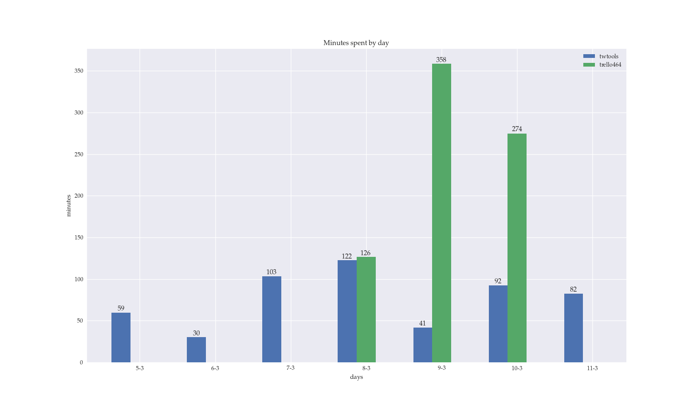
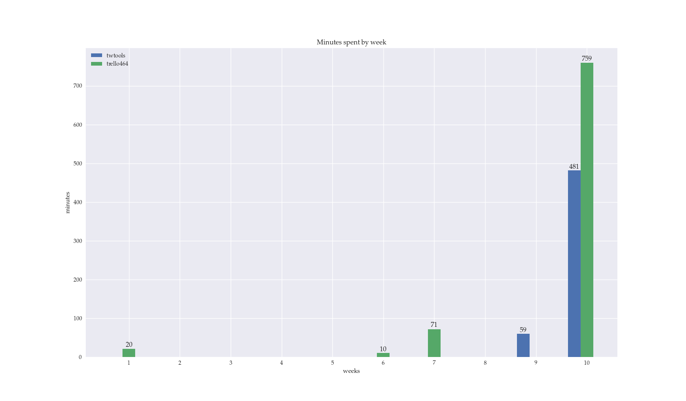

Timewarrior-tools
=================

Very simple set of scripts to get basic information from TimeWarrior.

Used to get some statistics and achieve some integration with Lemonbar and i3 WM.

Installation
------------

.. code-block:: bash

    python setup.py install

Tools: activity management
--------------------------

All of the tools included are available from the command line.

``twcurrent``
  Shows the activity currently ongoing and the time elapsed since the task has been started.

  Example:

  .. code-block:: bash

      twcurrent
      twtools 0:43:45

``twstop``
  Stops activity currently ongoing.

``twstart``
  Starts tracking a new activity.

  Example:

  .. code-block:: bash

      twstart writing

      Tracking writing
      Started 2017-03-11T14:24:11
      Current                  11
      Total               0:47:06

Tools: plotting intervals
-------------------------

The ``twstats`` command plots time spent on activities selected by tag, using ``matplotlib``.

Example:

.. code-block:: bash

    twstats twtools 'trello#416'

will filter by default activities with the tags ``twtools`` and ``trello#464`` in the last month and sum the intervals by day, outputting the following:

To use a different time span or granularity, flags are available:

.. code-block:: bash

    twstats --timespan '500days ago' --step week twtools 'trello#464'

Also, the stat tool comes with a comprehensive command line help: ``twstats --help``.

Misc notes
..........

* The script uses ``matplotlib``'s support for LaTeX to output the plot, so both must be installed.
* The script uses ``matplotlib``'s default style for the plot, but if ``seaborn`` is installed, it will be used.
